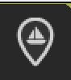
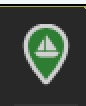
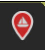
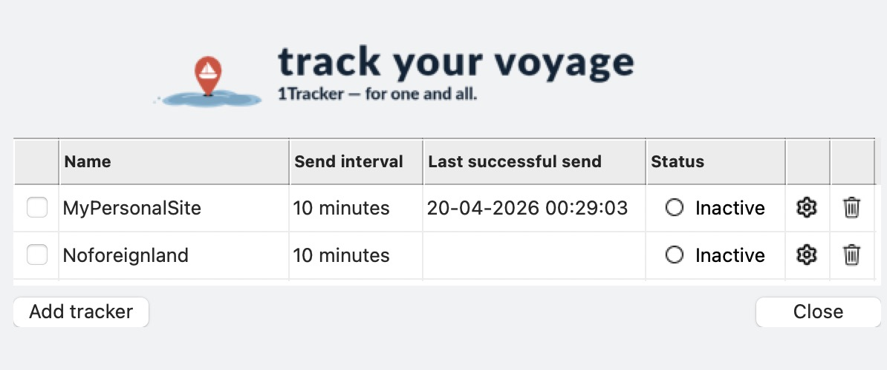
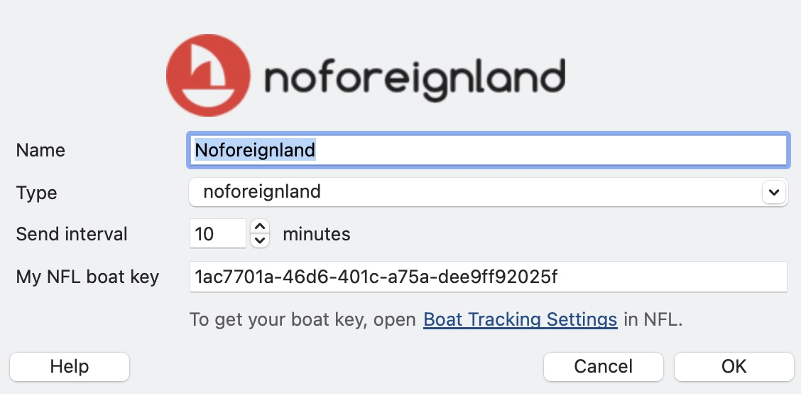
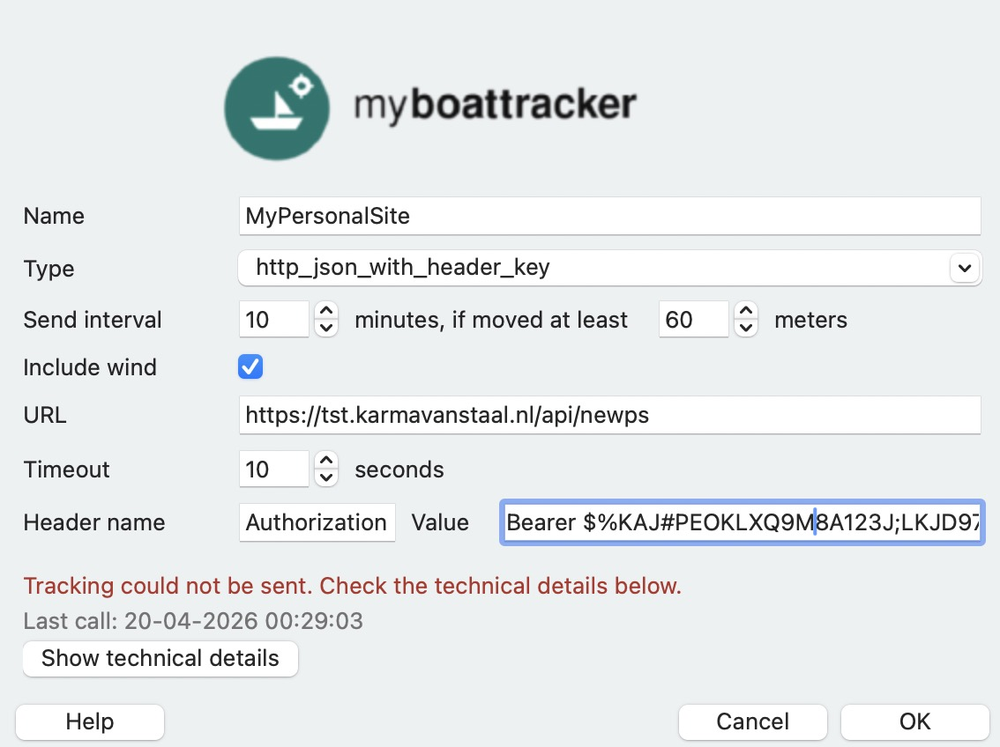
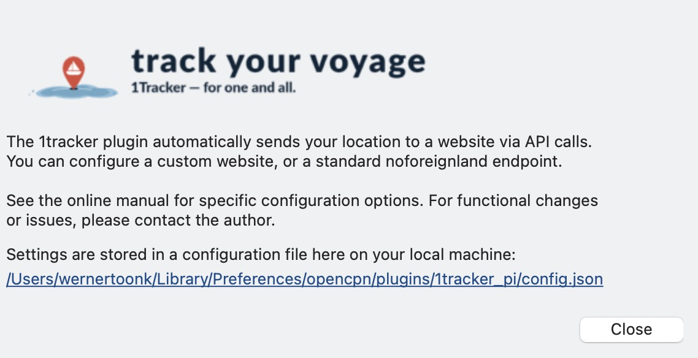

# 1tracker Plugin — User Manual

The **1tracker** plugin for OpenCPN periodically sends your boat's position (and optionally apparent wind) to one or more tracking websites via HTTP. It supports [NoForeignLand](https://www.noforeignland.com) out of the box, and any custom JSON HTTP endpoint.

---

## Contents

1. [Installation](#installation)
2. [Opening the Plugin](#opening-the-plugin)
3. [Toolbar Icon](#toolbar-icon)
4. [Adding a Tracker](#adding-a-tracker)
   - [NoForeignLand](#noforeignland)
   - [Custom JSON Endpoint](#custom-json-endpoint)
5. [Tracker Settings Explained](#tracker-settings-explained)
6. [Enabling and Disabling Trackers](#enabling-and-disabling-trackers)
7. [Configuration File](#configuration-file)
8. [Troubleshooting](#troubleshooting)
9. [Reporting Issues](#reporting-issues)

---

## Installation

Installation via the OpenCPN Plugin Catalog / Plugin Master is planned, but is **not available yet**.

For installation at this time, please **contact the author**.

> **Temporary note:** The goal is to make installation possible via the Plugin Master. Until that is available, please contact the author for installation instructions or a test package.

---

## Opening the Plugin

Click the **1tracker** toolbar button to open the preferences dialog. The dialog has three views:

- **Tracker list** — overview of all configured trackers and their status.
- **Tracker detail** — settings for a single tracker.
- **Info / Help** — location of the configuration file and general information.

---

## Toolbar Icon

The toolbar button changes colour to reflect the overall sending state:

| Icon | Meaning |
|------|---------|
|  | Plugin is enabled but no position fix yet, or all trackers are disabled. |
|  | At least one tracker is active and sending successfully. |
|  | At least one active tracker has encountered an error. |

---

## Adding a Tracker

Click **Add tracker** in the tracker list. A new entry appears; click the gear icon to open the detail editor.



### NoForeignLand

NoForeignLand (NFL) is a free community cruising platform at [noforeignland.com](https://www.noforeignland.com).

**Step 1 — Get your boat key**

1. Log in to NoForeignLand.
2. Go to [Boat Tracking Settings](https://www.noforeignland.com/map/settings/boat/tracking/api).
3. Copy your **Boat API key**.

**Step 2 — Configure the tracker**



| Field | Value |
|-------|-------|
| Name | Any label, e.g. `NoForeignLand` |
| Type | `noforeignland` |
| My NFL boat key | Paste the key you copied above |
| Send interval | Minimum **10 minutes** (NFL requirement) |
| Include wind | Optional — sends apparent wind angle and speed |

> **Note:** NFL ignores sends that arrive more frequently than 10 minutes or with less than 100 m of movement. The plugin enforces these limits automatically when you choose the `noforeignland` type.

**Step 3 — Enable and close**

Tick the **Enabled** checkbox, click **OK**, and the toolbar icon will turn green once a position has been sent.

---

### Custom JSON Endpoint

Use type `http_json_with_header_key` for any HTTP endpoint that accepts a JSON POST with an API key in a request header.



| Field | Value |
|-------|-------|
| Name | Any label |
| Type | `http_json_with_header_key` |
| URL | Full URL of your endpoint, e.g. `https://api.example.com/track` |
| Header name | The HTTP header that carries your API key, e.g. `X-API-Key` |
| Value | Your API key |
| Send interval | How often to send, in minutes |
| Min distance | Minimum movement in meters before sending again (0 = no limit) |
| Timeout | HTTP request timeout in seconds |
| Include wind | Optional |

The payload sent is a JSON object with this shape:

```json
{
  "action": "addPositions",
  "data": [
    {
      "timevalue": 1746281288,
      "lat": 51.8237,
      "lon": 4.1192,
      "awa": 35.5,
      "aws": 12.3
    }
  ]
}
```

Field details:

- `timevalue` — Unix epoch in **seconds** (integer)
- `lat`, `lon` — decimal degrees, WGS-84 (number)
- `awa`, `aws` — only present when **Include wind** is enabled and NMEA wind data is available; `awa` is apparent wind angle in degrees, `aws` is apparent wind speed in knots
- `data` is an array; each scheduled send currently posts a single position, but your endpoint should be ready to handle multiple entries

### Need a Different Tracker Type?

If your tracking service is not supported by either of the above types, additional tracker types can be added upon request. Please open an issue at [github.com/pa2wlt/1tracker_pi/issues](https://github.com/pa2wlt/1tracker_pi/issues) describing the service and its API.

---

## Tracker Settings Explained

| Setting | Description |
|---------|-------------|
| **Name** | Display label shown in the tracker list. |
| **Type** | Endpoint protocol. Choose `noforeignland` or `http_json_with_header_key`. |
| **Enabled** | Tick to activate sending for this tracker. |
| **URL** | The HTTP endpoint to POST to. For NFL this is filled in automatically. |
| **Send interval** | Minimum time between sends, in minutes. The plugin will not send more frequently than this even if you are moving. |
| **Min distance** | Minimum distance moved (in meters) since the last send before a new send is triggered. Useful to avoid flooding the endpoint while anchored. Set to `0` to disable distance filtering. |
| **Timeout** | How many seconds the plugin waits for an HTTP response before giving up. |
| **Header name / Value** | HTTP request header used to pass your API key. |
| **Include wind** | When ticked, apparent wind angle (AWA) and apparent wind speed (AWS) are included in the payload, if available from NMEA. |
| **Last successful send** | Timestamp of the most recent successful HTTP send. |
| **Status** | `Active` — sending normally. `Issue` — last send failed. `Inactive` — tracker is disabled. |

---

## Enabling and Disabling Trackers

- **Individual tracker**: tick or untick the checkbox in the tracker list, or the **Enabled** field in the detail screen.
- **All trackers at once**: close the dialog; the plugin keeps running. To stop all sending, disable the plugin in OpenCPN's plugin manager.

---

## Info / Help Screen



The Info screen shows the exact path to the configuration file on your machine, and links to the online manual and issue tracker.

---

## Configuration File

Settings are stored locally in a JSON file:

| Platform | Path |
|----------|------|
| macOS | `~/Library/Preferences/opencpn/plugins/1tracker_pi/config.json` |
| Linux | `~/.opencpn/plugins/1tracker_pi/config.json` |
| Windows | `%APPDATA%\opencpn\plugins\1tracker_pi\config.json` |

The file is created automatically on first run. You can edit it by hand, but using the plugin dialog is recommended. The plugin re-reads the file at startup.

---

## Troubleshooting

**Toolbar icon stays grey**
- Make sure OpenCPN has a GPS fix and is receiving NMEA position sentences.
- Check that at least one tracker is enabled.

**Toolbar icon turns red**
- Open the tracker list — the **Status** column will show which tracker has an issue.
- Open the tracker detail for that entry. An error message and a **Show technical details** button will appear.
- Common causes:
  - Wrong API key or boat key.
  - Incorrect URL.
  - No internet connectivity.
  - Send interval too low for the endpoint's requirements (NFL: 10 min minimum).

**NFL position not updating on the map**
- NFL compresses closely-spaced track points. Positions closer than 100 m or less than 10 minutes apart may not appear as separate points.
- Verify your boat key is correct in [NoForeignLand Boat Tracking Settings](https://www.noforeignland.com/map/settings/boat/tracking/api).

**Config file location**
The exact path is shown in the Info screen of the plugin dialog.

---

## Reporting Issues

Please report bugs and feature requests at:
**https://github.com/pa2wlt/1tracker_pi/issues**
